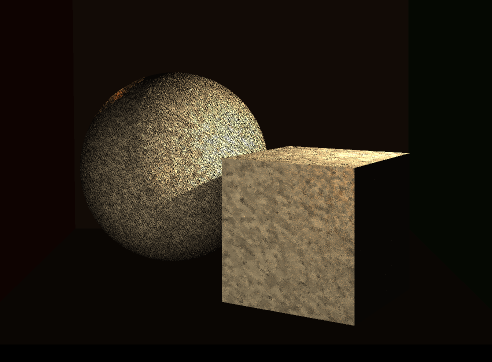
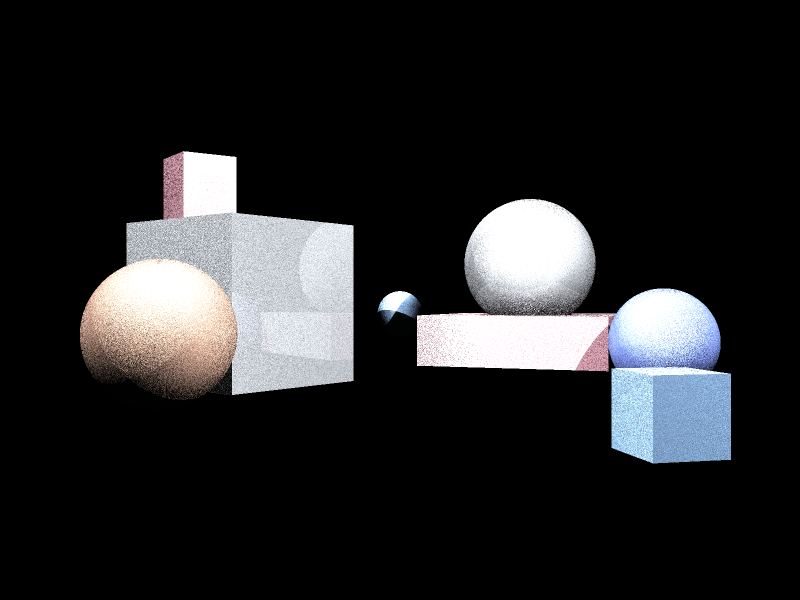
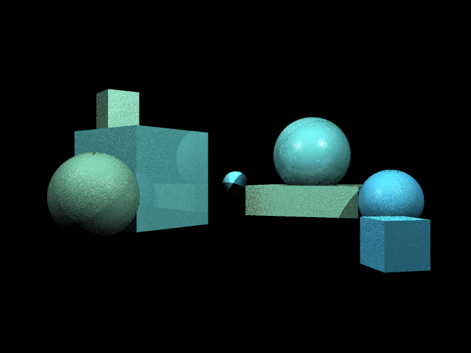
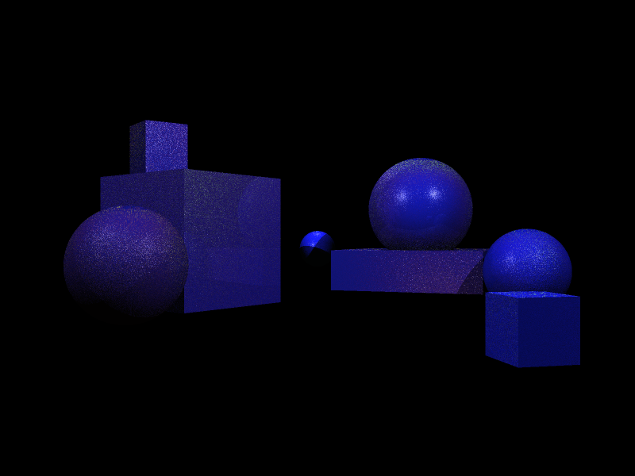
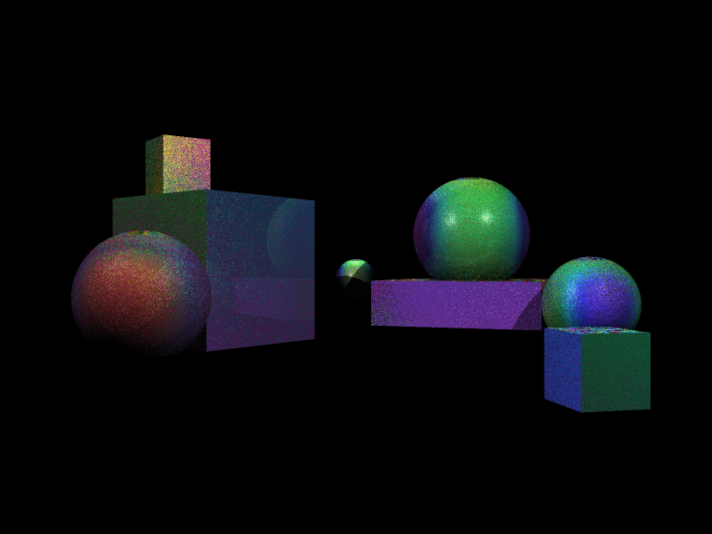

# Procedural Glitter Texture

A procedural glitter material built in C++ for a custom ray tracing system, with the project centered on the texture itself: how the flakes are generated, how they're shaded, & how the effect can be broken down into its components.

## Gallery

### Final Render


Scene includes two cool-toned glitter primitives under warm lighting for a gold glitter effect.

### Debug Views

| Normal response | Flake mask |
| --- | --- |
|  |  |

| Height field | Rotation map |
| --- | --- |
|  |  |

These PNGs are display-friendly copies of the raw `.ppm` outputs stored in `renderings/`.

## What This Project Does

The glitter texture is fully procedural. It generates flake patterns from layered mathematical principles & seeded randomness at render time for the geometry its applied to.

Each flake is built from:

- A lattice-space cell lookup driven by a deterministic hash
- Randomized position jitter so the flakes don't grid themselves
- A blend between circular & hexagonal signed-distance shapes
- Per-flake  variation in shade, sparkle intensity, height, & rotation
- A triplanar fallback so the effect wraps more naturally across different object orientations

The result is a surface that appears as a reflective cosmetic or craft glitter material.

## Workflow

The material was built in layers so the look could be tuned & debugged incrementally:

1. Procedural flake mask
2. Shape variation via mixing circular & hexagonal flakes
3. Introduction of jitter & seeded randomness so neighboring flakes feel irregular
4. Per-flake height field & use of finite differences for bump-style normal perturbation
5. Visualization passes for mask, height, normal response, & rotation
6. Testing on different base materials (reflective, colored, etc.)

This workflow made it much easier to tune parameters like scale, feathering, flake size ranges, & sparkle variation.

## System Breakdown

### 1. Glitter Generation

The core glitter logic lives in `src/textures/glitter.h`.

Important pieces of that file:

- `GlitterParams`: centralizes the artistic controls for scale, flake radii, sparkle range, height range, jitter, & seed
- `sample_glitter(...)`: evaluates the procedural pattern in lattice space & picks the dominant nearby flake
- `sample_glitter_triplanar(...)`: blends projections across axes so the texture works better on non-flat surfaces
- `GlitterTexture::sample(...)`: converts flake data into the final rendered color
- `GlitterTexture::bump_normal(...)`: computes a perturbed normal from the generated height field

### 2. Shading Integration

The texture is integrated into the lighting pipeline in `src/components/illumination.h`.

That stage:

- Samples the glitter texture at the hit point
- Multiplies the sample against the object's diffuse material color
- Detects glitter textures specifically & applies subtle bump-based normal perturbation before Phong lighting is evaluated

This is what helps the flakes feel embedded in the surface of the objects.

### 3. Showcase Scenes

There are two CPU-side scene setups:

- `src/render_cpu.cpp`: the main render layout, using a Cornell-box-style setup with glitter-coated objects
- `src/render_cpu_visualization.cpp`: a dedicated scene for debugging & presenting the texture behavior across several objects, scales, & visualization modes

## Running The Project

Build with CMake:

```bash
cmake -S . -B build -DCMAKE_BUILD_TYPE=Release
cmake --build build -j
```

Run the main render:

```bash
./build/raytracer_cpu
```

Run the visualization renderer:

```bash
./build/raytracer_visualization
```

Outputs are written to:

- `output_img.ppm`
- `output_viz_normal.ppm`
- `output_viz_mask.ppm`
- `output_viz_height.ppm`
- `output_viz_rotation.ppm`

## Project Files

- `src/textures/glitter.h` - procedural glitter generation, coloring, & bump logic
- `src/components/illumination.h` - lighting integration with glitter sampling
- `src/render_cpu.cpp` - main showcase render
- `src/render_cpu_visualization.cpp` - debug & visualization renders
- `docs/images/` - PNG copies of the renderer outputs for this README

## Takeaway

This goal of this project was to design a realistic glitter-like procedural surface material in my custom-built ray tracing system .. just because glitter is fun (while also being visually & technically complex)! I enjoyed getting to play around with different ideas & methodologies, & I'm really happy with the final product, especially the effects of the texture under colored lighting.
